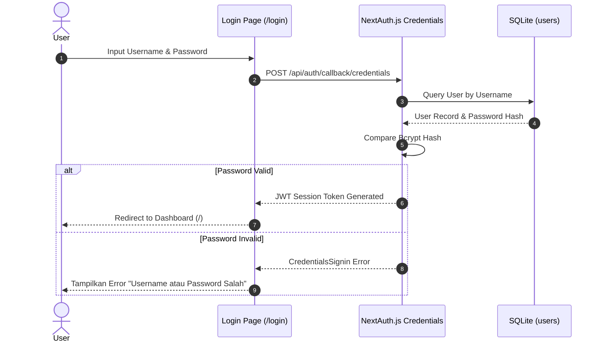
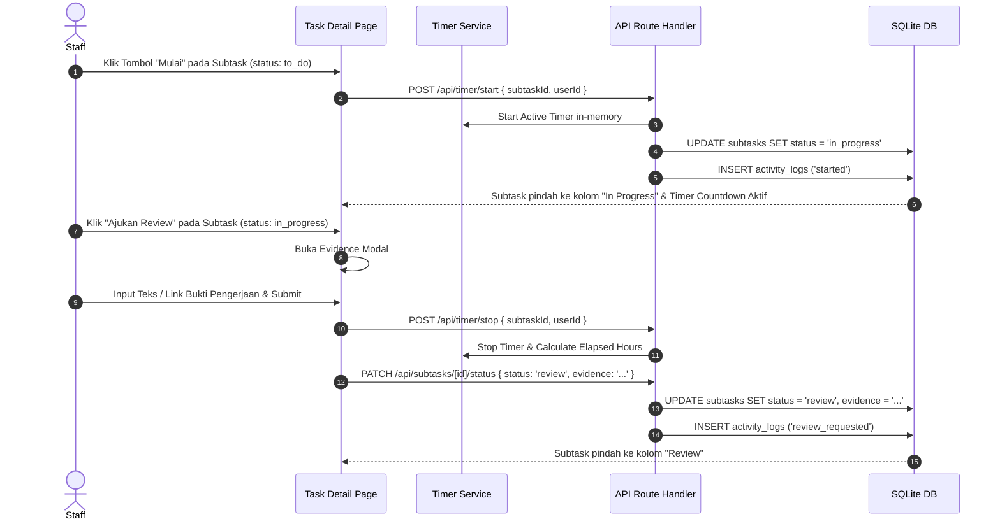
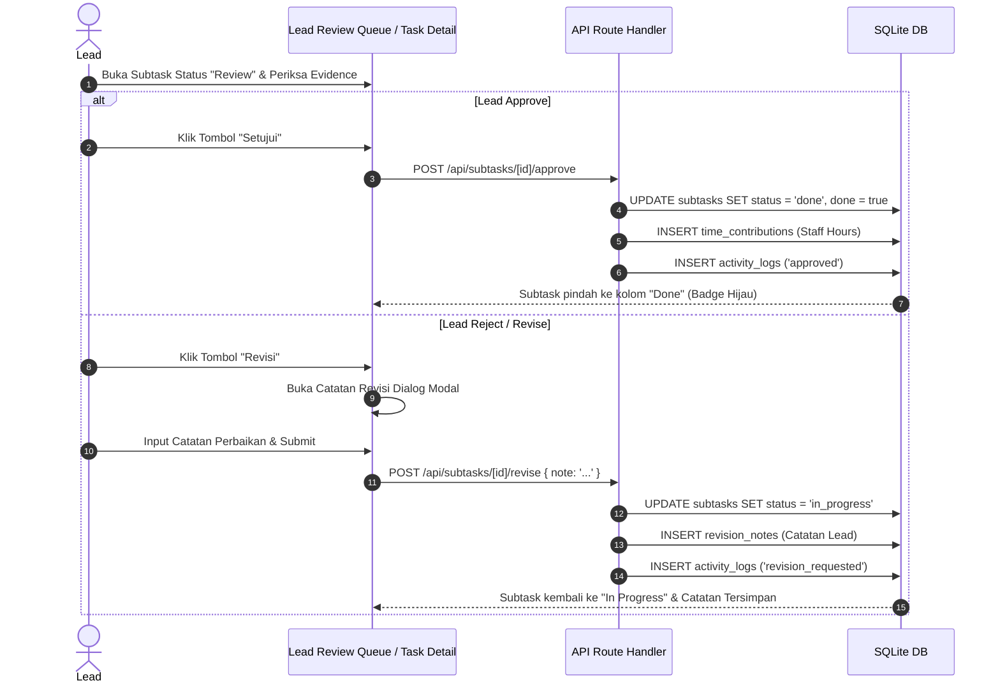
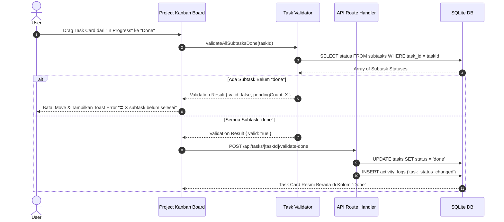
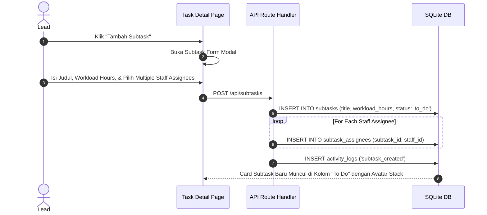

# PRD — Project Requirements Document

> **Versi:** 3.3 — Diperbarui 28 Juli 2026 (Pengembalian Detail Penuh + Spesifikasi Fitur, Flow, RBAC Matrix & Struktur Data Lengkap)
>
> **Status Simbol:**
> ✅ Terimplementasi &nbsp;&nbsp; ⚠️ Sebagian/Stub &nbsp;&nbsp; 🔲 Rencana (Belum) &nbsp;&nbsp; 🛠️ Perlu Perbaikan (Gap dari keputusan desain)

---

## 1. Overview & Filosofi Sistem

**TaskFlow Pro (BRD Task Forge)** adalah sistem manajemen tugas, proyek, dan kinerja internal enterprise yang dirancang untuk meningkatkan transparansi, akuntabilitas, dan efisiensi alur kerja tim melalui struktur hierarki tiga tingkat (**Project → Task → Subtask**). Aplikasi mengadopsi struktur peran berbasis hirarki (*Staff, Lead, Kadep, Kadiv, Super Admin*) serta mekanisme validasi akuntabilitas ketat berbasis bukti (*evidence*) dan approval Lead di level Subtask.

Aplikasi dibangun menggunakan **Next.js 16 (App Router) + Tailwind CSS v4 + SQLite (`better-sqlite3`) / Drizzle ORM**, mengusung desain modern ala Figma (Geist & Geist Mono typeface, pastel color-block sections, top navigation non-sidebar, serta interaksi fluid berbasis `@dnd-kit`). Data aplikasi tersimpan secara persisten di **SQLite database** (`taskforge.db`) dengan **Drizzle ORM** sebagai type-safe data access layer. Database di-seed dengan **124 project, 427 task, 1.752 subtask, 21 user, 5.881 activity log, 2.670 subtask assignee, dan 1.456 time contribution records** yang mensimulasikan lingkungan produksi skala penuh.

### 1.1 Filosofi Desain
- **Task-First & Execution-Oriented Workflow:** Fokus visual adalah alur pengerjaan tugas interaktif (Kanban), bukan sekadar tabel administrasi statis.
- **Navigasi Top-Bar Non-Sidebar:** Struktur navigasi bersih menggunakan Top Navigation Bar yang dipadukan dengan Breadcrumb kontekstual hierarkis (`Dashboard → Project → Task Detail`).
- **Antarmuka Modern Modern-Figma Aesthetic:** Pemanfaatan *monochrome core*, *pastel color-block cards*, *pill-shaped status badges*, *avatar stacks dynamic*, dan animasi *micro-interactions*.
- **Strict Single Source of Truth for Assignment:** Penugasan pelaksana pengerjaan tugas utama selalu mengacu pada tabel *many-to-many* `subtask_assignees`, sementara `tasks.pic_name` murni difungsikan sebagai identitas administratif tiket.

---

## 2. Status Implementasi Ringkas (34 Fitur Utama)

| Area / Fitur Utama | Status | Halaman / File Utama | Deskripsi Implementasi |
|---|:---:|---|---|
| **Dashboard Executive (Level 0)** | ✅ | `src/app/page.tsx` | Ringkasan KPI, Charts, Review Queue Lead, Project Cards |
| **Project View Kanban (Level 1)** | ✅ | `src/app/project/[projectId]/page.tsx` | Papan Task Kanban (3 Kolom: To Do, In Progress, Done) |
| **Task Detail View (Level 2)** | ✅ | `src/app/project/[projectId]/task/[taskId]/page.tsx` | Subtask Kanban (4 Kolom), Activity Feed, Evidence Viewer |
| **Task Kanban Board** | ✅ | `kanban-board.tsx` | Drag-and-drop @dnd-kit, Toolbar Filter, User Simulation |
| **Subtask Kanban Board** | ✅ | `subtask-kanban.tsx` | 4 Kolom: `to_do`, `in_progress`, `review`, `done` |
| **Drag-and-Drop System** | ✅ | `sortable-task-card.tsx` | Dibatasi hak akses assignee/lead via sensor @dnd-kit |
| **Multi-Assignee Subtask** | ✅ | `subtask_assignees` table | Many-to-many relationship per Subtask (2.670 record) |
| **Field `pic_name` pada Tasks** | ✅ | Schema DB `tasks.pic_name` | Menggantikan field `assignee` lama (Migrasi 0002) |
| **Staff Capacity Management** | ✅ | Schema DB `users.capacity_hours_per_month` | Kapasitas default 160 jam/bulan, editable di `/users` |
| **Evidence Submission Engine** | ✅ | `EvidenceDialog.tsx` | Bukti pengerjaan teks/link wajib di Subtask `review` |
| **Activity Audit Logging** | ✅ | `activity-service.ts` | 5.881 record aktivitas kronologis persisten |
| **Timer Countdown & Tracking** | ✅ | `use-timer-countdown.ts` | Melacak estimasi workload vs elapsed time real-time |
| **Role Simulation Bar** | ✅ | `role-filter.tsx` | Pengujian perpindahan role user client-side |
| **Lead Review Queue** | ✅ | `ReviewTaskCard` | Queue persetujuan subtask status `review` bagi Lead |
| **Unique Ticket ID Generator** | ✅ | `ticket-generator.ts` | Format: `[Proj]-[No]-[PIC]-[Lead]` |
| **Validation: Strict Completion** | ✅ | `task-validator.ts` | Task tidak bisa Done jika ada subtask pending |
| **Revision Notes System** | ✅ | `revision_notes` table | Catatan penolakan/revisi Lead tersimpan permanen |
| **Sprint History (Read-Only)** | ✅ | `/sprint-history/page.tsx` | Grafik tren 10 sprint & tabel detail project |
| **Sprint Report** | ✅ | `/sprint-report/page.tsx` | Summary KPI & breakdown per sprint |
| **Individual Metrics** | ✅ | `/individual-metrics/page.tsx`| Utilisasi, akurasi, & scoring per individu |
| **Performance Reports** | ✅ | `/reports/page.tsx` | Laporan bulanan/kuartalan dengan role filtering |
| **Activity History Page** | ✅ | `/activity-history/page.tsx`| Audit trail global seluruh event aplikasi |
| **User Management** | ✅ | `/users/page.tsx` | CRUD User, pengaturan role & kapasitas |
| **Settings Page** | ✅ | `/settings/page.tsx` | Integrasi Spreadsheet & preferensi notifikasi |
| **Export Engine (PDF & Excel)** | ✅ | `/api/reports/export/*` | Memakai `jspdf`, `jspdf-autotable`, & `exceljs` |
| **Zustand State Store** | ✅ | `use-task-store.ts` | Caching state task per project & UI state |
| **Zod API Validation** | ✅ | `validations.ts` | Schema parsing & sanitasi input pada API route |
| **Rate Limiter** | ✅ | `rate-limiter.ts` | In-memory limiter 100 req/min/IP |
| **Authentication System** | ⚠️ | `/api/auth/[...nextauth]` | NextAuth.js v5 credentials strategy terpasang |
| **Middleware Route Protection** | ⚠️ | `src/middleware.ts` | Sebagian route dilindungi middleware |
| **Google Sheets Sync Engine** | ⚠️ | `/api/sync/pull` | Endpoint API & Apps Script tersedia |
| **Auto Sprint Cut-off** | 🔲 | - | Belum ada job penjadwalan 2-mingguan otomatis |
| **Staff Assignment History** | 🔲 | - | Rencana histori perubahan tim |
| **PostgreSQL Migration** | 🔲 | - | Rencana migrasi dari SQLite ke Postgres |

---

## 3. Spesifikasi Fungsional, Aturan Bisnis & Matriks Peran (RBAC)

### 3.1 Hierarki Tiga Tingkat
Pengelolaan kerja wajib mematuhi struktur **Project → Task → Subtask**:
1. **Project (Level 1):** Container induk (contoh: *"Pooling"*, *"Sentra"*). Memiliki target sprint, Lead penanggung jawab, dan tanggal *sprint cut-off*.
2. **Task (Level 2):** Unit pekerjaan utama dalam satu Project. Memiliki ticket ID unik, prioritas, deadline, dan Papan Kanban 3 Kolom (*To Do, In Progress, Done*).
3. **Subtask (Level 3):** Detail instruksi pengerjaan spesifik di bawah Task. Memiliki Papan Kanban 4 Kolom (*to_do, in_progress, review, done*), estimasi *workload hours*, bukti pengerjaan (*evidence*), dan multi-assignee.

### 3.2 Matriks Hak Akses Peran (RBAC Matrix)

Aplikasi memiliki 5 tingkat role hirarkis: **Staff**, **Lead**, **Kadep**, **Kadiv**, dan **Super Admin**.

| Modul / Tindakan | Staff | Lead | Kadep | Kadiv | Super Admin |
|---|:---:|:---:|:---:|:---:|:---:|
| **Lihat Dashboard & Ringkasan KPI** | Staff Only Data | Team Data | Dept Data | Divisi Data | All Data |
| **Lihat Lead Review Queue** | ❌ | ✅ (Timnya) | ✅ (Deptnya) | ✅ (Divisinya) | ✅ (Semua) |
| **Drag & Drop Task ke 'In Progress'** | ✅ (Assignee) | ✅ | ✅ | ✅ | ✅ |
| **Drag & Drop Task ke 'Done'** | ❌ | ✅ (Lead Proyek) | ✅ | ✅ | ✅ |
| **Drag Subtask ('to_do' → 'in_progress')** | ✅ (Assignee) | ✅ | ✅ | ✅ | ✅ |
| **Submit Evidence Subtask** | ✅ (Assignee) | ✅ | ✅ | ✅ | ✅ |
| **Persetujuan Subtask ('review' → 'done')** | ❌ | ✅ (Lead Proyek) | ✅ | ✅ | ✅ |
| **Revisi Subtask ('review' → 'in_progress')** | ❌ | ✅ (Wajib Note) | ✅ | ✅ | ✅ |
| **Buat / Edit Project Baru** | ❌ | ❌ | ✅ | ✅ | ✅ |
| **Buat / Edit Task Baru** | ❌ | ✅ | ✅ | ✅ | ✅ |
| **Buat / Edit Subtask Baru** | ✅ | ✅ | ✅ | ✅ | ✅ |
| **Kelola User & Kapasitas (`/users`)** | ❌ | Read-Only | Read-Only | Read-Only | ✅ Full CRUD |
| **Akses Laporan Kinerja (`/reports`)** | Self Only | Team Only | Dept Only | Divisi Only | Global |
| **Ekspor PDF & Excel Laporan** | ✅ (Self) | ✅ (Team) | ✅ (Dept) | ✅ (Divisi) | ✅ (Global) |
| **Akses Konfigurasi Settings** | ❌ | ❌ | ❌ | ❌ | ✅ |

### 3.3 Formula Kalkulasi Kinerja (Goldilocks Rule)

Kalkulasi kinerja dihitung secara presisi menggunakan **Goldilocks Rule** (`src/lib/performance-calculator.ts`):

#### 3.3.1 Score Utilisasi Workload
\[
\text{Raw Utilization (\%)} = \left( \frac{\text{Workload Hours}}{\text{Net Capacity Hours}} \right) \times 100
\]
- **Underload (< 80%):** \(\text{Score} = \text{Math.round}\left(\frac{\text{Raw Utilization}}{80} \times 100\right)\)
- **Optimal (80% - 100%):** \(\text{Score} = 100\) (Sweet Spot)
- **Overload (> 100%):** Penalti 1 poin per 1% kelebihan: \(\text{Score} = \text{Math.max}\left(0, 100 - (\text{Raw Utilization} - 100)\right)\)

#### 3.3.2 Formula Penimbangan Peran (Staff vs Lead)
- **Staff Score (Bobot 50/50):**
  \[
  \text{Staff Score} = \text{Math.round}\left(\text{UtilisationScore} \times 0.5 + \text{SubtaskCompletionScore} \times 0.5\right)
  \]
- **Lead Score (Bobot Dinamis 3 Skenario):**
  1. *Dual Role (Eksekusi Subtask + Review Tim):* \(0.333 \times \text{Util} + 0.333 \times \text{Subtask} + 0.334 \times \text{Review}\)
  2. *Pure Managerial (0 Subtask Mandiri, Review Tim):* \(0.4 \times \text{Util} + 0.6 \times \text{Review}\)
  3. *Pure Individual Contributor (Subtask Mandiri, 0 Review):* \(0.5 \times \text{Util} + 0.5 \times \text{Subtask}\)

---

## 4. Katalog Detail SEMUA Fitur Aplikasi (34 Fitur)

### 4.1 UI Layout Level 0: Dashboard (`/`)
```text
┌──────────────────────────────────────────────────┐
│  Top Nav: TaskFlow Pro | Riwayat | Metrik | ...  │
├──────────────────────────────────────────────────┤
│  HERO: "Ringkasan Proyek & Kinerja"              │
├──────────────────────────────────────────────────┤
│  STAT CARDS: Total | In Progress | Selesai% | Terlambat │
├──────────────────────────────────────────────────┤
│  REVIEW QUEUE (Lead+ only): Kartu task perlu review │
├──────────────────────────────────────────────────┤
│  CHARTS: Task Distribution | Sprint Velocity     │
├──────────────────────────────────────────────────┤
│  CHART: Workload per Staff                        │
├──────────────────────────────────────────────────┤
│  PROJECT CARDS: Pooling, Sentra dll              │
└──────────────────────────────────────────────────┘
```
1. **Top Navigation Bar & Breadcrumb Bar (`BreadcrumbBar`):** Navigation bar bersih di bagian atas menggantikan sidebar.
2. **Executive Stat Cards (`StatCard`):** 4 Kartu statistik utama di bagian atas dashboard (Total, In Progress, Selesai, Terlambat).
3. **Task Distribution Chart (`TaskDistributionChart`):** Chart lingkaran (Doughnut Chart Recharts).
4. **Sprint Velocity Chart (`SprintVelocityChart`):** Grafik batang (Bar Chart Recharts) target vs aktual.
5. **Sprint Trend Chart (`SprintTrendChart`):** Grafik garis tren 10 sprint historis.
6. **Workload per Staff Chart (`WorkloadChart`):** Grafik batang horizontal distribusi jam kerja.
7. **Lead Review Queue (`ReviewTaskCard`):** Antrean subtask status `review`.
8. **Project Card Grid (`ProjectCard`):** Grid proyek dengan progress bar dan avatar lead.
9. **Role Simulation & User Filter Bar (`RoleFilter`):** Fitur ganti peran testing client-side.
10. **Deadline Notification Alert (`DeadlineNotification`):** Notifikasi H-2 atau overdue.

### 4.2 UI Layout Level 1: Project Kanban (`/project/[projectId]`)
```text
┌──────────────────────────────────────────────────┐
│  Breadcrumb: TaskFlow Pro / Project Title         │
├──────────────────────────────────────────────────┤
│  TOOLBAR: [Search...] [Priority] [Assignee]       │
├──────────────────────────────────────────────────┤
│  KANBAN BOARD (3 Kolom)                           │
│  [ To Do ]        [ In Progress ]   [ Done ]      │
│  - Task Card      - Task Card       - Task Card   │
└──────────────────────────────────────────────────┘
```
11. **Level 1 Project Kanban Board (`KanbanBoard`):** 3 kolom status.
12. **Kanban Toolbar (`KanbanToolbar`):** Input search teks real-time & filter dropdown.
13. **Sortable Task Card (`SortableTaskCard`):** Kartu Task draggable (`@dnd-kit`).

### 4.3 UI Layout Level 2: Task Detail & Subtask Kanban (`/project/[projectId]/task/[taskId]`)
```text
┌──────────────────────────────────────────────────┐
│  Breadcrumb: TaskFlow Pro / Project / Task Title  │
├──────────────────────────────────────────────────┤
│  TASK HEADER: ticketId, priority, deadline status │
│  Title, Assignee (derived), Lead, Deadline        │
│  MetadataSection (description, goals, dod)        │
│  Progress bar: "X/Y Subtask selesai"             │
├──────────────────────────────────────────────────┤
│  CONSOLIDATED ACTIVITY FEED                      │
├──────────────────────────────────────────────────┤
│  SUBTASK KANBAN (4 kolom)                        │
│  [ to_do ]   [ in_progress ]   [ review ]   [ done ]
│  - Subtask   - Subtask         - Subtask    - Subtask
└──────────────────────────────────────────────────┘
```
14. **Level 2 Task Detail View:** Halaman task lengkap dengan header info.
15. **Metadata Section (`MetadataSection`):** Description, Goals, dan Definition of Done.
16. **Level 3 Subtask Kanban Board (`SubtaskKanban`):** Papan Kanban 4 kolom (`to_do`, `in_progress`, `review`, `done`).
17. **Multi-Assignee Avatar Stack:** Tumpukan avatar staff pelaksana dari tabel `subtask_assignees`.
18. **Evidence Submission Engine (`EvidenceDialog`):** Modal upload URL/Teks sebelum status `review`.
19. **Real-Time Timer Countdown Hook (`use-timer-countdown.ts`):** Menampilkan estimasi workload vs live elapsed time.
20. **Staff Time Summary (`StaffTimeSummary`):** Total kontribusi jam per staff.
21. **Time Tracking Summary (`TimeTrackingSummary`):** Total akumulasi jam aktual task.
22. **Subtask Activity Log (`ActivityLog`):** Log riwayat waktu mulai, pause, review tiap subtask.
23. **Consolidated Activity Feed (`ConsolidatedActivityFeed`):** Log gabungan di atas task.
24. **Lead Revision Notes Workflow (`revision_notes`):** Modal input revisi Lead saat menolak subtask.

### 4.4 Fitur Analisis Kinerja, Laporan & Administrasi
25. **Strict Task Completion Validation Engine (`task-validator.ts`):** Validasi seluruh subtask harus `done` sebelum task `done`.
26. **Unique Ticket ID Generator Service (`ticket-generator.ts`):** `[Proj]-[No]-[PIC]-[Lead]`.
27. **Read-Only Sprint History Page (`/sprint-history`):** Riwayat tren 10 sprint lalu.
28. **Sprint Final Report Page (`/sprint-report`):** Evaluasi akhir per sprint.
29. **Individual Performance Metrics Page (`/individual-metrics`):** Kartu metrik (Utilisasi, Akurasi) per individu.
30. **Performance Reports Page (`/reports`):** Laporan bulanan/kuartalan dengan role filtering.
31. **Report PDF & Excel Export Engine (`export-buttons.tsx`):** Pen-generate `jspdf` & `exceljs`.
32. **Global Audit History Page (`/activity-history`):** Audit trail seluruh aksi app.
33. **User & Capacity Management Page (`/users`):** Mengatur `capacityHoursPerMonth`.
34. **Settings & Google Sheets Sync Page (`/settings`):** Pengaturan sync Google Sheets.

---

## 5. Dokumentasi SEMUA User Flow Aplikasi (9 Flow Lengkap)

### 5.1 Flow 1: Authentication & User Login Flow


### 5.2 Flow 2: Staff Subtask Execution Flow (`to_do` → `in_progress` → `review`)


### 5.3 Flow 3: Lead Subtask Review & Approval / Rejection Flow


### 5.4 Flow 4: Task Status Transition & Strict Completion Validation Flow


### 5.5 Flow 5: Subtask Creation & Multi-Assignee Allocation Flow


### 5.6 Flow 6: Time Tracking & Manual Timer Operations Flow
- **Start Timer:** Staff memicu `/api/timer/start`. In-memory store (`timer-store.ts`) mencatat `startedAt` timestamp.
- **Stop Timer:** Staff memicu `/api/timer/stop`. Timer service menghitung durasi selisih waktu `(stoppedAt - startedAt) / 3600000`, dibulatkan ke 1 desimal. Durasi dicatat ke `activity_logs.duration_hours` dan dialokasikan ke `time_contributions`.

### 5.7 Flow 7: Performance Report Generation & PDF/Excel Export Flow
- **Generate Report Data:** Client memanggil `GET /api/reports?period=bulanan`. API me-query data agregat dan menjalankan `aggregateStaffMetrics()` (Goldilocks Rule).
- **Export PDF:** Client POST `ReportData` ke `/api/reports/export/pdf`. Server menggambar dokumen `jspdf-autotable` dan mengirim binary Blob.
- **Export Excel:** Client POST `ReportData` ke `/api/reports/export/excel`. Server membuild workbook `exceljs` multi-sheet bergaya.

### 5.8 Flow 8: User Capacity Management & Administrative Settings Flow
- Admin membuka `/users`, mengedit field `capacityHoursPerMonth` (default 160).
- Client memanggil `PATCH /api/users/[userId]`. API memvalidasi input via Zod.
- Perubahan ini otomatis mempengaruhi perhitungan Utilization Score.

### 5.9 Flow 9: Google Sheets Data Synchronization Flow (Push & Pull)
- **Pull Sync:** Client memicu `POST /api/sync/pull`. API endpoint call Google Apps Script (`sync-pull.gs`). Apps Script membaca row GSheets dan mengirim JSON kembali ke API untuk di-`UPSERT` ke SQLite.
- **Push Sync:** Client memicu `POST /api/sync/push`. API mengumpulkan agregat Project dan POST JSON ke webhook Google Apps Script untuk ditulis ke tab "Report" GSheets.

---

## 6. Struktur Data Detail & Skema Database

Database menggunakan **SQLite** (`taskforge.db`) melalui **Drizzle ORM** (`src/db/schema.ts`).

### 6.1 Tabel Database (Drizzle ORM Code)

```typescript
import { sqliteTable, text, integer, real } from "drizzle-orm/sqlite-core";

// 1. users
export const users = sqliteTable("users", {
  id: text("id").primaryKey(), // UUID
  nama: text("nama").notNull(),
  username: text("username").unique().notNull(),
  passwordHash: text("password_hash").notNull(), // Hash bcryptjs
  role: text("role", { enum: ["staff", "lead", "kadep", "kadiv", "super_admin"] }).notNull().default("staff"),
  department: text("department"),
  capacityHoursPerMonth: real("capacity_hours_per_month").notNull().default(160),
  leaveDays: real("leave_days").notNull().default(0),
  createdAt: text("created_at").notNull(),
  updatedAt: text("updated_at").notNull(),
});

// 2. projects
export const projects = sqliteTable("projects", {
  id: text("id").primaryKey(), // UUID
  title: text("title").notNull(),
  description: text("description"),
  goals: text("goals"),
  dod: text("dod"), // Definition of Done
  sprint: text("sprint").notNull(),
  leadId: text("lead_id").references(() => users.id),
  sprintCutoff: text("sprint_cutoff"),
  isArchived: integer("is_archived", { mode: "boolean" }).default(false),
  createdAt: text("created_at").notNull(),
  updatedAt: text("updated_at").notNull(),
});

// 3. revision_notes
export const revisionNotes = sqliteTable("revision_notes", {
  id: integer("id").primaryKey({ autoIncrement: true }),
  subtaskId: text("subtask_id").notNull(),
  taskId: text("task_id").notNull(),
  leadId: text("lead_id").references(() => users.id),
  note: text("note").notNull(),
  action: text("action", { enum: ["rejected", "revision_requested"] }).notNull().default("rejected"),
  createdAt: text("created_at").notNull(),
  updatedAt: text("updated_at").notNull(),
});

// 4. tasks
export const tasks = sqliteTable("tasks", {
  id: text("id").primaryKey(),
  ticketId: text("ticket_id").notNull().unique(), // [Proj]-[No]-[PIC]-[Lead]
  title: text("title").notNull(),
  description: text("description"),
  goals: text("goals"),
  dod: text("dod"),
  status: text("status", { enum: ["todo", "in-progress", "review", "done"] }).notNull().default("todo"),
  priority: text("priority", { enum: ["low", "medium", "high", "urgent"] }).notNull().default("medium"),
  picName: text("pic_name").notNull(),
  leadId: text("lead_id").references(() => users.id),
  projectId: text("project_id").references(() => projects.id),
  totalActualHours: real("total_actual_hours").default(0),
  deadline: text("deadline"),
  createdAt: text("created_at").notNull(),
  updatedAt: text("updated_at").notNull(),
});

// 5. subtasks
export const subtasks = sqliteTable("subtasks", {
  id: text("id").primaryKey(),
  taskId: text("task_id").notNull().references(() => tasks.id, { onDelete: "cascade" }),
  title: text("title").notNull(),
  description: text("description"),
  goals: text("goals"),
  dod: text("dod"),
  evidence: text("evidence"),
  done: integer("done", { mode: "boolean" }).notNull().default(false),
  status: text("status", { enum: ["to_do", "in_progress", "review", "done"] }).notNull().default("to_do"),
  workloadHours: real("workload_hours").notNull().default(0),
  createdAt: text("created_at").notNull(),
  updatedAt: text("updated_at").notNull(),
});

// 6. subtask_assignees (Many-to-Many)
export const subtaskAssignees = sqliteTable("subtask_assignees", {
  id: integer("id").primaryKey({ autoIncrement: true }),
  subtaskId: text("subtask_id").notNull().references(() => subtasks.id, { onDelete: "cascade" }),
  staffId: text("staff_id").references(() => users.id),
  assignedAt: text("assigned_at").notNull(),
});

// 7. activity_logs
export const activityLogs = sqliteTable("activity_logs", {
  id: text("id").primaryKey(),
  subtaskId: text("subtask_id").references(() => subtasks.id, { onDelete: "cascade" }),
  taskId: text("task_id").references(() => tasks.id),
  userId: text("user_id").references(() => users.id),
  action: text("action", {
    enum: [
      "created", "started", "paused", "resumed", "completed",
      "review_requested", "approved", "revision_requested",
      "task_created", "task_status_changed", "task_rejected", "task_approved",
      "subtask_created", "assignee_added", "assignee_removed",
    ],
  }).notNull(),
  timestamp: text("timestamp").notNull(),
  durationHours: real("duration_hours").notNull().default(0),
  durationCategory: text("duration_category", { enum: ["work", "wait_review"] }),
  durationSeconds: integer("duration_seconds"),
  note: text("note"),
});

// 8. time_contributions
export const timeContributions = sqliteTable("time_contributions", {
  id: integer("id").primaryKey({ autoIncrement: true }),
  subtaskId: text("subtask_id").notNull().references(() => subtasks.id, { onDelete: "cascade" }),
  staffId: text("staff_id").references(() => users.id),
  hours: real("hours").notNull().default(0),
});
```

### 6.2 Zod Validation Schemas (`src/lib/validations.ts`)
```typescript
import { z } from "zod";

export const uuidSchema = z.string().uuid("ID harus UUID valid");

export const createTaskSchema = z.object({
  title: z.string().min(1).max(200),
  description: z.string().max(2000).optional().default(""),
  projectId: uuidSchema,
  leadId: uuidSchema,
  picName: z.string().min(1).max(100),
  deadline: z.string().datetime().optional(),
  workloadHours: z.number().min(0).max(1000).optional(),
});

export const updateTaskSchema = z.object({
  title: z.string().min(1).max(200).optional(),
  status: z.enum(["todo", "in-progress", "review", "done"]).optional(),
  leadId: uuidSchema.optional(),
  picName: z.string().optional(),
});

export const createSubtaskSchema = z.object({
  title: z.string().min(1).max(200),
  taskId: uuidSchema,
  workloadHours: z.number().min(0.5).max(100).optional().default(2),
  assigneeIds: z.array(uuidSchema).min(1).max(5).optional().default([]),
});

export const revisionNoteSchema = z.object({
  note: z.string().min(1, "Catatan revisi wajib diisi").max(2000),
});

export const createUserSchema = z.object({
  nama: z.string().min(1).max(100),
  username: z.string().min(3).max(50).regex(/^[a-z0-9_]+$/),
  password: z.string().min(6),
  role: z.enum(["staff", "lead", "kadep", "super_admin"]),
  capacityHoursPerMonth: z.number().min(1).max(744).optional().default(160),
});
```

### 6.3 TypeScript Interfaces (`src/lib/types.ts`)
```typescript
export type TaskStatus = "todo" | "in-progress" | "review" | "done";
export type SubtaskStatus = "to_do" | "in_progress" | "review" | "done";

export interface Subtask {
  id: string;
  title: string;
  evidence?: string;
  done: boolean;
  status: SubtaskStatus;
  assignees: string[]; // List of avatar names/images
  timeContributions: StaffTimeContribution[];
  workloadHours: number;
  activityLog: ActivityLogEntry[];
}

export interface Task {
  id: string;
  ticketId: string;
  title: string;
  status: TaskStatus;
  priority: "low" | "medium" | "high" | "urgent";
  picName: string;
  lead: string;
  subtasks: Subtask[];
  deadline: string;
}

export interface StaffMetric {
  name: string;
  role: string;
  capacity: number;
  workload: number;
  utilization: number;
  subtasksDone: number;
  subtasksTotal: number;
  performanceScore: number;
  performanceCategory: string;
  weightBreakdown?: string;
}
```

---

## 7. Spesifikasi API Endpoints (35 Route Handler Lengkap)

| Modul | Method | Path Route | Input Body / Query | Output Response Format | Deskripsi Fitur |
|---|---|---|---|---|---|
| **Auth** | `GET/POST`| `/api/auth/[...nextauth]` | Credentials | Session Cookie | NextAuth authentication |
| **Dashboard** | `GET` | `/api/dashboard` | `?role=...` | Aggregate JSON | Metrik KPI dashboard (Hero, Stats, Charts) |
| **Sprints** | `GET` | `/api/sprints` | - | `SprintGroupItem[]` | Data riwayat sprint 10 siklus terakhir |
| **Project** | `GET` | `/api/projects/[id]/tasks` | - | `Task[]` | Task list per proyek beserta subtask & assignees |
| **Project** | `GET` | `/api/projects/[id]` | - | `Project` | Detail Project dan konfigurasinya |
| **Task** | `GET` | `/api/tasks/[id]` | - | `Task` detail | Task + subtasks tree + logs penuh |
| **Task** | `GET` | `/api/tasks/[id]/subtasks` | `?status=...` | `Subtask[]` | Filter subtasks spesifik dalam satu task |
| **Task** | `GET` | `/api/tasks/[id]/validate-done`| - | `ValidationResult` | Cek kelayakan `done` (semua subtask `done`) |
| **Task** | `POST`| `/api/tasks/[id]/validate-done`| - | `{ task, validation }` | Eksekusi status `done` pada Task Utama |
| **Task** | `POST`| `/api/tasks/[id]/reject` | `{ note }` | `{ success: true }` | Tolak task kembali ke in-progress secara makro |
| **Task** | `GET` | `/api/tasks/[id]/revision-notes`| - | `RevisionNote[]` | Riwayat catatan revisi pada task tersebut |
| **Task** | `PATCH`| `/api/tasks/[id]/status` | `{ status }` | `Task` | Update status task langsung |
| **Task** | `GET` | `/api/tasks/review` | `?lead=...` | `Task[]` | Queue review lead (menampilkan task dengan subtask `review`) |
| **Task** | `POST`| `/api/tasks/review/approve` | `{ taskId }` | `{ success: true }` | Bulk setujui semua subtask review di dalam Task |
| **Task** | `POST`| `/api/tasks/review/reject` | `{ taskId, note }` | `{ success: true }` | Bulk tolak semua subtask review di dalam Task |
| **Task** | `PATCH`| `/api/tasks/bulk` | `{ taskIds, status }`| `{ updatedCount }` | Bulk update tasks |
| **Subtask** | `POST`| `/api/subtasks` | `CreateSubtask` | `Subtask` | Buat subtask baru beserta assignees |
| **Subtask** | `PATCH`| `/api/subtasks/[id]` | `UpdateSubtask` | `Subtask` | Edit detail metadata subtask |
| **Subtask** | `PATCH`| `/api/subtasks/[id]/status` | `{ status, evidence }`| `Subtask` | Shift status subtask + simpan evidence secara atomik |
| **Subtask** | `GET` | `/api/subtasks/[id]/activity` | - | `ActivityLogEntry[]`| Activity log khusus subtask tersebut |
| **Subtask** | `POST`| `/api/subtasks/[id]/activity` | `ActivityLogInput` | `ActivityLogEntry` | Tambah log manual |
| **Subtask** | `GET` | `/api/subtasks/[id]/assignees`| - | `User[]` | List user assignee dari tabel `subtask_assignees` |
| **Subtask** | `POST`| `/api/subtasks/[id]/approve` | - | `{ success: true }` | Lead setujui subtask review menjadi `done` |
| **Subtask** | `POST`| `/api/subtasks/[id]/revise` | `{ note }` | `{ success: true }` | Lead tolak subtask kembali ke `in_progress` + wajib Note |
| **Subtask** | `PATCH`| `/api/subtasks/bulk` | `{ subtaskIds, status }`| `{ updatedCount }` | Bulk update status subtask |
| **Timer** | `POST`| `/api/timer/start` | `{ subtaskId, userId }` | `{ activeTimer, log }` | Start timer di server memory |
| **Timer** | `POST`| `/api/timer/stop` | `{ subtaskId, userId }` | `{ log, contribution }`| Stop timer, hitung selisih & simpan ke `time_contributions` |
| **Timer** | `GET` | `/api/timer/status` | `?subtaskId=...` | `{ active, elapsed }` | Polling state timer in-memory |
| **Users** | `GET` | `/api/users` | - | `User[]` | List seluruh data user (termasuk kapasitas & departemen) |
| **Users** | `POST`| `/api/users` | `CreateUser` | `User` | Registrasi / Tambah user baru (oleh Admin) |
| **Users** | `PATCH`| `/api/users/[id]` | `UpdateUser` | `User` | Edit kapasitas bulanan atau role user |
| **Users** | `DELETE`| `/api/users/[id]` | - | `{ success: true }` | Soft-delete/Hapus permanen user |
| **Reports**| `GET` | `/api/reports` | `?period=...` | `ReportData` | Payload data agregasi laporan & metrik performance (Goldilocks) |
| **Export** | `POST`| `/api/reports/export/pdf` | `ReportData` | PDF Buffer | Stream file PDF laporan eksekutif via `jspdf` |
| **Export** | `POST`| `/api/reports/export/excel` | `ReportData` | XLSX Buffer | Stream file workbook Excel multiformat via `exceljs` |
| **Activity**| `GET` | `/api/activity/logs` | - | `ActivityLog[]` | Audit trail global untuk Page Activity History |
| **Activity**| `GET` | `/api/activity/staff` | `?staffId=...` | `ActivityLog[]` | Audit trail spesifik milik staff tertentu |
| **Sync** | `POST`| `/api/sync/pull` | - | `{ syncedCount }` | Tarik & timpa data dari Google Sheets |
| **Sync** | `POST`| `/api/sync/push` | - | `{ success: true }` | Dorong laporan sprint terbaru ke Google Sheets |
| **Settings**| `GET/PUT/POST`| `/api/settings/spreadsheet`| `SpreadsheetConfig` | `SpreadsheetConfig` | Save & load pengaturan sheet URL |

---

## 8. Tech Stack & Arsitektur Infrastruktur

### 8.1 Matrix Tech Stack & Dependencies Aktual

| Layer | Teknologi | Versi | Deskripsi & Fungsi |
|---|---|---|---|
| **Framework Utama** | Next.js (App Router) | `16.2.12` | Server & Client React Framework (React 19.2.4) |
| **Bahasa Pemrograman** | TypeScript | `5.0+` | Static Type Checking di seluruh layer aplikasi |
| **Sistem UI & CSS** | Tailwind CSS | `v4` | Styling modular menggunakan utility classes dengan Geist Fonts |
| **Database Engine** | SQLite (`better-sqlite3`) | `13.0.1` | Local embedded database tersimpan pada `taskforge.db` |
| **Data Access & ORM** | Drizzle ORM | `0.45.2` | Engine query builder type-safe modern pengganti Prisma |
| **Migrasi Skema** | Drizzle Kit | `0.31.10` | CLI untuk generate migrasi SQL otomatis (`npx drizzle-kit`) |
| **Autentikasi** | NextAuth.js (Auth.js) | `5.0.0-beta.32`| Sistem otentikasi Credentials dengan kapabilitas middleware |
| **Kriptografi / Hash**| `bcryptjs` | `3.0.3` | Hashing password staff di database SQLite |
| **Data Validation** | Zod | `4.4.3` | Eksekutor validasi payload HTTP API Request |
| **State Management** | Zustand | `5.0.14` | In-memory UI State (`useUiStore`) & Cache (`useTaskStore`) |
| **Drag and Drop Engine**| `@dnd-kit/core` | `6.3.1` | Library DnD Kanban Board interaktif yang accessible |
| **Visualisasi Data** | Recharts | `2.15.1` | Sistem chart interaktif SVG (Bar, Line, Doughnut) di Dashboard |
| **Generator Laporan (PDF)**| `jspdf` + `jspdf-autotable`| `4.2.1`/`5.0.8` | Mesin cetak otomatis laporan kinerja dalam bentuk file PDF |
| **Generator Laporan (XLSX)**| `exceljs` | `4.4.0` | Node.js XLSX file builder untuk multi-sheet file report Excel |

---

## 9. Struktur Folder dan File Tree Aktual (100+ File)

Project memisahkan domain berdasarkan metode **Feature-Driven Architecture** di dalam folder `src/features/`.

```text
brd-task-forge/
├── apps-script/
│   └── sync-pull.gs                       # Code Google Apps Script sinkronisasi data
├── drizzle/
│   ├── meta/                              # Snapshot Drizzle ORM per-migrasi
│   ├── 0001_clever_carmella_unuscione.sql # Migrasi Rebuild FK constraints
│   ├── 0002_strange_power_man.sql         # Migrasi Users table + pic_name (Fase 0)
│   └── db.sqlite3                         # Development SQLite copy
├── public/                                # Assets, SVG Ikon (file.svg, globe.svg, dll)
└── src/
    ├── app/
    │   ├── api/                           # 35+ Route Handler Next.js Backend
    │   │   ├── activity/, auth/, dashboard/, projects/, reports/, settings/
    │   │   ├── sprints/, subtasks/, sync/, tasks/, timer/, users/
    │   ├── activity-history/page.tsx      # Halaman Audit Trail Global
    │   ├── individual-metrics/page.tsx    # Halaman Individu Utilisasi & Akurasi
    │   ├── login/page.tsx                 # Form Autentikasi NextAuth
    │   ├── project/[projectId]/page.tsx   # Level 1 Kanban Board (Task 3 Kolom)
    │   │   └── task/[taskId]/page.tsx     # Level 2 Task Detail & Subtask 4 Kolom
    │   ├── reports/page.tsx               # Halaman Generator Laporan PDF/Excel
    │   ├── settings/page.tsx              # Konfigurasi Admin
    │   ├── sprint-history/page.tsx        # Riwayat Grafik Tren Sprint
    │   ├── sprint-report/page.tsx         # Rangkuman Evaluasi Sprint
    │   ├── users/page.tsx                 # CRUD Kapasitas & Registrasi User
    │   ├── globals.css                    # Tailwind CSS v4 directives
    │   ├── layout.tsx                     # Root App Layout HTML
    │   └── page.tsx                       # Dashboard Level 0
    ├── components/
    │   ├── shared/                        # 12 Shared UI Components (Pill, Badge, Toast, Modal)
    │   │   ├── breadcrumb-bar.tsx, confirm-dialog.tsx, deadline-notification.tsx
    │   │   ├── dev-mode-bar.tsx, export-buttons.tsx, toast.tsx, skeletons.tsx, dll.
    │   └── ui/                            # Custom UI Primitives (Tooltip, Collapsible)
    ├── db/
    │   ├── index.ts                       # Konektor better-sqlite3 ke Drizzle
    │   ├── migrate.ts                     # Script eksekutor migrasi otomatis
    │   ├── schema.ts                      # 8 Tabel Schema Utama SQLite
    │   └── seed.ts                        # Seeder 10,000+ data (Users, Tasks, Subtasks)
    ├── features/                          # Domain-Driven Features
    │   ├── auth/                          # Layanan NextAuth.js
    │   ├── dashboard/                     # 10 Chart & Widget Dashboard
    │   ├── kanban/                        # 5 Komponen Drag and Drop Papan Kanban
    │   ├── project/                       # Ringkasan Proyek
    │   ├── reports/                       # Formulasi & Agregasi Data PDF/Excel
    │   ├── task/                          # Detail Task, Subtask Engine, & Log Validator
    │   └── user/                          # Role Staff Validator
    ├── lib/                               # Core Utilities & Library Helpers
    │   ├── api-utils.ts, logger.ts, rate-limiter.ts, validations.ts (Zod)
    │   ├── performance-calculator.ts      # FORMULA KINERJA (Goldilocks Rule)
    │   ├── realtime-sync.ts, types.ts
    │   └── stores/                        # Zustand Store
    │       ├── use-task-store.ts          # State UI Papan Kanban per-project
    │       └── use-ui-store.ts            # Light/Dark Theme & Layout State
    └── proxy.ts                           # Konfigurasi Proxy Network
```

---

## 10. Catatan Teknis, Keamanan & Known Issues

### 10.1 Keamanan & Standar Koding
- **Rate Limiting Engine:** In-memory rate limiter `src/lib/rate-limiter.ts` membatasi maksimal 100 request/menit per IP untuk menangkal brute-force.
- **Zod Data Validation:** Setiap endpoint POST/PATCH API diwajibkan melewati parsing `validate(schema, body)` (Zod Runtime Parsing) sebelum instruksi diteruskan ke Database ORM.
- **Password Hashes:** Disimpan menggunakan modul `bcryptjs`. Tidak ada password plaintext dalam environment, seed `seed.ts` pun juga men-generate raw bcrypt sebelum INSERT.

### 10.2 Known Issues (Bugs Teridentifikasi)
1. **Ticket ID Format Mismatch di Data Seed (Fase 1 Legacy):** Data seed historis lama menggunakan format `T-XXXX-PICNAME`, sedangkan generator runtime aplikasi produksi telah menggunakan logika `[Project]-[No]-[PIC]-[Lead]`. Tidak error, hanya mismatch visual di riwayat task lampau.
2. **React Missing Key Prop Warning:** Terdapat peringatan (warning) React minor di console log browser pada file `SprintReportPage` saat mapping array component (React 19 Strict Mode Warning).
3. **Route Protection Enforcement via Middleware:** Implementasi NextAuth Route Protection di `middleware.ts` belum sepenuhnya mem-block semua path client, sebagian validasi masih terjadi di client-side menggunakan pattern HOC (Higher-Order Component).

---

## 11. Changelog Dokumentasi

### v3.3 — 28 Juli 2026 (Pengembalian Skala Penuh + Kedalaman Ultra Detail)
- ➕ **Pengembalian Kode Sumber (Section 6):** Menuliskan ulang dan mengekspos isi penuh 8 blok Drizzle ORM Schema Database, blok kode Type Definition TypeScript, dan kode Blok Skema Validasi Zod yang sebelumnya sempat terhapus di versi ringkas v3.2.
- ➕ **Visualisasi ASCII Layout UI (Section 4):** Menambahkan kembali mapping layout teks UI (Level 0, Level 1, Level 2) untuk panduan developer Frontend, plus membedah 34 fitur ke masing-masing halaman.
- ➕ **Direktori Tree Lengkap 100+ File (Section 9):** Menuliskan eksak struktur file yang ada dalam disk untuk memudahkan agent dan engineer memahami navigasi project.
- ➕ **Penguatan API Handler (Section 7):** Merapikan kembali tabel 35 endpoints beserta Payload Format & Respon yang akurat.
- 🔄 **Pertahanan Konten Valid dari v3.2:** Matriks RBAC 5 tingkat dan Flow Diagram Sequence 9 kasus pengguna tetap dipertahankan dengan tingkat ketelitian tinggi.

### v3.2 — 28 Juli 2026
- Transformasi tabel matriks RBAC dan penjabaran narasi flow ke Diagram Sequence Mermaid. (versi ringkas)